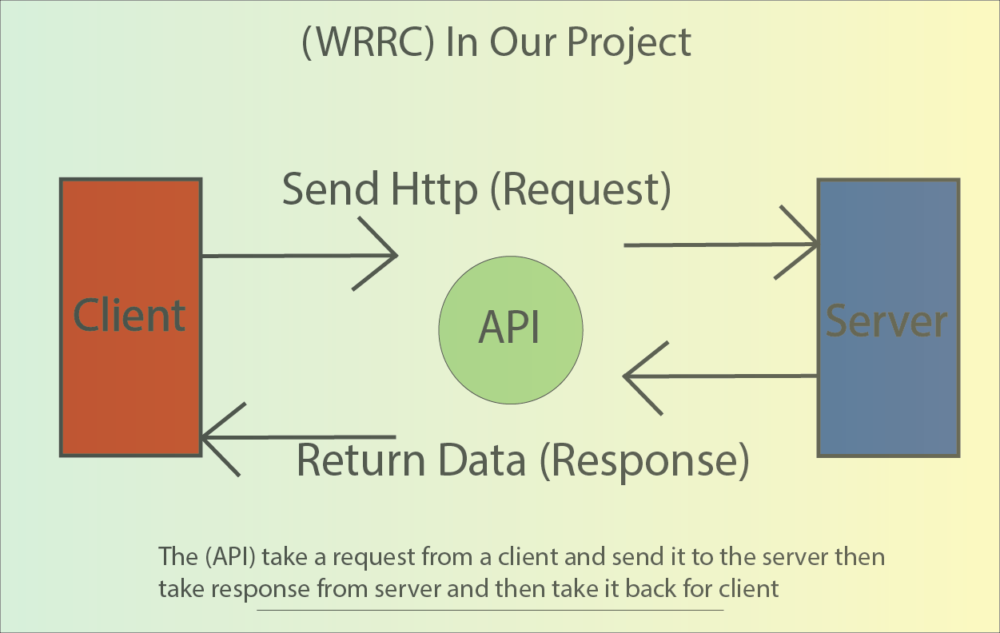

# city-explorer

# Project Name  city explorer

**Author**: Murad Alkhatib & Ashrf Obeidat
**Version**: 1.0.0 (increment the patch/fix version number if you make more commits past your first submission)

## Overview
this app will help the users get deatiled weather information about any city the want 

## Getting Started
the user should just type in the name of the city to get the requiered information

## Architecture
react , bootstap , axios,express and node where used un making of the app

## Change Log

08-09-2021 4:59pm - Application now has a fully-functional express server, with a GET route for the location resource. -->

## Credit and Collaborations
<!-- Give credit (and a link) to other people or resources that helped you build this application. -->
Time Estimates
For each of the lab features, make an estimate of the time it will take you to complete the feature, and record your start and finish times for that feature:

 ## Name of feature: create the strucure of the app 

Estimate of time needed to complete: 20min

Start time: 1:30

Finish time: 2:00

Actual time needed to complete: 30 min

## Name of feature: adding bootstrap card and form 

Estimate of time needed to complete: 20min

Start time: 2:00

Finish time: 2:10

Actual time needed to complete: 10 min

## Name of feature: create run the express server 

Estimate of time needed to complete:20 min

Start time: 2:30

Finish time: 2:55

Actual time needed to complete: 25 min
 

## Name of feature: creating the routes for the get requestes

Estimate of time needed to complete:30 min

Start time: 3:00

Finish time: 3:40

Actual time needed to complete: 40 min

## Name of feature: link the server api to the react app

Estimate of time needed to complete:10 min

Start time: 3:40

Finish time: 4:00

Actual time needed to complete: 15 min

